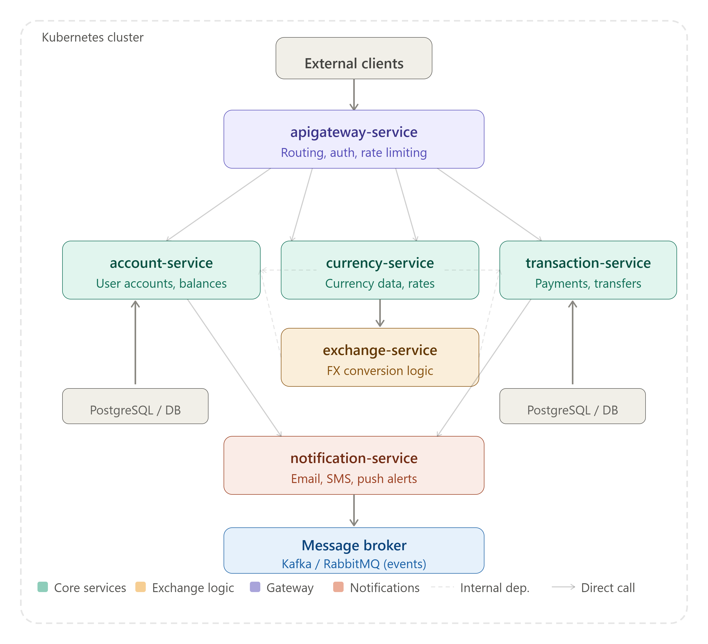
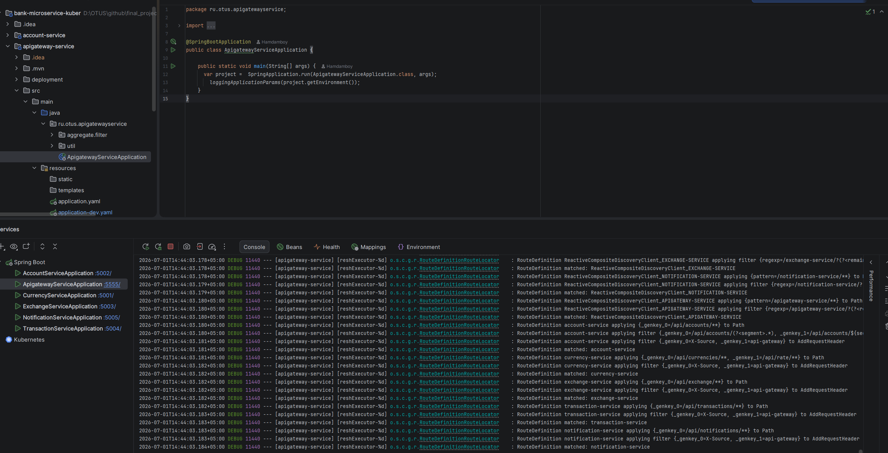
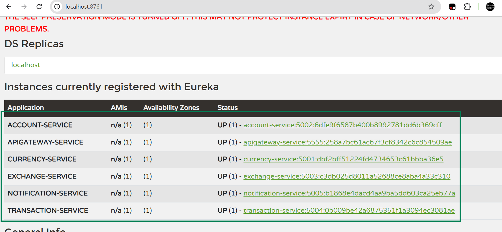

# Microservice project infrastructure Kubernet: Bank Exchange Services
---
> **bank-microservice-kuber** — учебный проект на базе микросервисной архитектуры для банковской системы обмена валют.  
> Построен на **Spring Boot 3 + Spring Cloud Gateway + Eureka + Helm/Kubernetes**.

>  **All data  just for use-cases**. If you want to use, without permission just clone from github. 
> 
>   Все данные приведены только для примера использования. Если вы хотите использовать их без разрешения, 
просто клонируйте репозиторий с GitHub.
> 
---
- [Архитектура](#-архитектура)
- [Сервисы](#-сервисы)
- [Технологии](#-технологии)
- [Быстрый старт](#-быстрый-старт)
    - [Предварительные требования](#предварительные-требования)
    - [1. Запуск баз данных](#1-запуск-баз-данных)
    - [2. Запуск Eureka Server](#2-запуск-eureka-server)
    - [3. Запуск сервисов](#3-запуск-сервисов)
- [Kubernetes / Helm](#-kubernetes--helm)
- [Eureka Service Discovery](#-eureka-service-discovery)
- [API маршруты (Gateway)](#-api-маршруты-gateway)
- [Структура проекта](#-структура-проекта)
- [Скриншоты](#-скриншоты)
- [Авторы](#-авторы)
---
## Архитектура 



Каждый сервис работает как отдельный **Kubernetes Deployment + Service** внутри кластера.  
Межсервисное взаимодействие выполняется через:

- **Eureka** — регистрация и обнаружение сервисов
- **Spring Cloud OpenFeign** — декларативные HTTP-клиенты между сервисами
- **Spring Cloud Gateway** — единая точка входа для внешнего трафика
- **Internal DNS** — `lb://service-name` внутри кластера

---

## Сервисы

| Сервис | Порт   | Описание |
|---|--------|---|
| `apigateway-service` | `5555` | Единая точка входа. Маршрутизация, CORS, логирование запросов |
| `account-service` | `5002` | Управление банковскими счетами и балансами |
| `currency-service` | `5001` | Метаданные валют и обменные курсы в реальном времени |
| `exchange-service` | `5003` | Конвертация валюты (оркестрирует currency + account + transaction) |
| `transaction-service` | `5004` | Платежи и переводы между счетами |
| `notification-service` | `5005` | Email / SMS / Push уведомления о событиях |


---
### Описание сервисов и github:
 - [apigateway-service](https://github.com/Urunov/bank-microservice-kuber/tree/dev/apigateway-service) — единая точка входа для всего внешнего трафика. Обрабатывает маршрутизацию, аутентификацию и ограничение скорости перед переадресацией запросов нижестоящим сервисам.
 - [account-service](https://github.com/Urunov/bank-microservice-kuber/tree/dev/account-service) — управляет банковскими счетами и балансами пользователей. Вероятно, использует реляционную базу данных (PostgreSQL).
 - [currency-service](https://github.com/Urunov/bank-microservice-kuber/tree/dev/currency-service) — предоставляет метаданные валют и данные об обменных курсах в реальном времени, которые используются в логике обмена.
 - [exchange-service](https://github.com/Urunov/bank-microservice-kuber/tree/dev/exchange-service) — сервис, который был изменен в последний раз. Обрабатывает конвертацию валюты, объединяя данные из currency-service, account-service и transaction-service.
 - [transaction-service](https://github.com/Urunov/bank-microservice-kuber/tree/dev/transaction-service) — обрабатывает платежи и переводы; списывает/зачисляет средства на счета и запускает уведомления.
 - [notification-service](https://github.com/Urunov/bank-microservice-kuber/tree/dev/notification-service) — отправляет электронные письма/SMS/push-уведомления о событиях, связанных со счетами или транзакциями, на основе событий из account-service и transaction-service.


### Схема взаимодействия сервисов

```
External Client
      │
      ▼
apigateway-service (:5555)
      │
      ├──► account-service (:5002)  ◄──────────────────┐
      │                                                 │
      ├──► currency-service (:5001)                     │
      │          │                                      │
      │          ▼                                      │
      ├──► exchange-service (:5003) ────────────────────┤
      │                                                 │
      ├──► transaction-service (:5004) ─────────────────┘
      │          │
      │          ▼
      └──► notification-service (:5005)
```

---

## Технологии

| Категория | Технология |
|---|---|
| Язык | Java 21 |
| Фреймворк | Spring Boot 3.4.5 |
| Gateway | Spring Cloud Gateway (Reactive) |
| Service Discovery | Netflix Eureka |
| HTTP клиент | Spring Cloud OpenFeign |
| ORM | Spring Data JPA + Hibernate |
| База данных | PostgreSQL 15 |
| Миграции БД | Liquibase |
| Маппинг | MapStruct 1.5 |
| Контейнеризация | Docker + Docker Compose |
| Оркестрация | Kubernetes + Helm |
| Сборка | Maven 3.9 |

---

## Быстрый старт

### Предварительные требования

- Java 21+
- Maven 3.9+
- Docker & Docker Compose
- kubectl + Helm 3 (для Kubernetes)

### 1. Запуск баз данных

Каждый сервис использует собственную базу данных PostgreSQL.

```bash
docker run -d --name account-db   -e POSTGRES_DB=account_db   -e POSTGRES_USER=arm7 -e POSTGRES_PASSWORD=arm7k@fk@! -p 5432:5432 postgres:15
docker run -d --name currency-db  -e POSTGRES_DB=currency_db  -e POSTGRES_USER=arm7 -e POSTGRES_PASSWORD=arm7k@fk@! -p 5433:5432 postgres:15
docker run -d --name exchange-db  -e POSTGRES_DB=exchange_db  -e POSTGRES_USER=arm7 -e POSTGRES_PASSWORD=arm7k@fk@! -p 5434:5432 postgres:15
docker run -d --name transaction-db -e POSTGRES_DB=transaction_db -e POSTGRES_USER=arm7 -e POSTGRES_PASSWORD=arm7k@fk@! -p 5435:5432 postgres:15
docker run -d --name notification-db -e POSTGRES_DB=notification_db -e POSTGRES_USER=arm7 -e POSTGRES_PASSWORD=arm7k@fk@! -p 5436:5432 postgres:15
```

> Скриншот баз данных в Docker:


---

### 2. Запуск Eureka Server

> Убедитесь, что Eureka Server запущен **до** старта остальных сервисов.

```bash
# Если Eureka является отдельным модулем:
cd eureka-server
mvn spring-boot:run
```

По умолчанию Eureka доступна по адресу: **http://localhost:8761**

---

### 3. Запуск сервисов

Запуск каждого сервиса локально (порядок важен):

```bash
# 1. currency-service
cd currency-service && mvn spring-boot:run

# 2. account-service
cd account-service && mvn spring-boot:run

# 3. exchange-service
cd exchange-service && mvn spring-boot:run

# 4. transaction-service
cd transaction-service && mvn spring-boot:run

# 5. notification-service
cd notification-service && mvn spring-boot:run

# 6. apigateway-service (последним)
cd apigateway-service && mvn spring-boot:run
```

Или через Docker Compose (в каждом сервисе):

```bash
cd account-service && docker-compose up -d
cd currency-service && docker-compose up -d
# ... и так далее для каждого сервиса
```

>  Все сервисы запущены:



---

##  Kubernetes / Helm

Каждый сервис содержит Helm chart в директории `deployment/helm/`.

### Деплой одного сервиса

```bash
helm install account-app ./account-service/deployment/helm/account-app \
  --set image.tag=1.0 \
  --set config.SPRING_DATASOURCE_URL="jdbc:postgresql://postgres:5432/account_db"
```

### Деплой всех сервисов

```bash
for svc in account exchange transaction notification apigateway; do
  helm install ${svc}-app ./${svc}-service/deployment/helm/${svc}-app
done
```

### Структура Helm chart (каждый сервис)

```
deployment/helm/
├── <service>-app/
│   ├── Chart.yaml          # Метаданные чарта
│   └── values.yaml         # Переменные окружения, ресурсы, порты
└── templates/
    ├── _helpers.tpl         # Вспомогательные шаблоны
    ├── deployment.yaml      # Kubernetes Deployment
    ├── service.yaml         # Kubernetes Service (ClusterIP / LoadBalancer)
    ├── ingress.yaml         # Kubernetes Ingress (nginx)
    └── configmap.yaml       # Переменные окружения из values.yaml
```

---

## Eureka Service Discovery

Все сервисы регистрируются в Eureka автоматически при старте.



| Параметр | Значение |
|---|---|
| Eureka URL | `http://localhost:8761/eureka/` |
| Настройка | `EUREKA_CLIENT_SERVICEURL_DEFAULTZONE` |
| Prefer IP | `true` |

---

## API маршруты (Gateway)

Все запросы проходят через **apigateway-service** на порту `5555`:

| Маршрут | Сервис назначения | Пример |
|---|---|---|
| `/api/accounts/**` | `account-service` | `GET /api/accounts/get/all` |
| `/api/currencies/**` | `currency-service` | `GET /api/currencies/get/all` |
| `/api/rate/**` | `currency-service` | `GET /api/rate/exchange/get?from=USD&to=UZS` |
| `/api/exchange/**` | `exchange-service` | `POST /api/exchange/convert` |
| `/api/transactions/**` | `transaction-service` | `POST /api/transactions/transfer` |
| `/api/notifications/**` | `notification-service` | `POST /api/notifications/send/email` |

---

## Структура проекта

```
bank-microservice-kuber/
├── apigateway-service/
│   ├── src/main/java/ru/otus/apigatewayservice/
│   │   ├── aggregate/filter/       # CORSFilter, LoggingFilter
│   │   └── util/                   # ProjectStartingPoint
│   ├── src/main/resources/
│   │   └── application-dev.yaml    # Маршруты Gateway
│   ├── deployment/helm/
│   ├── Dockerfile
│   └── docker-compose.yml
│
├── account-service/
│   ├── src/main/java/ru/otus/accountservice/
│   │   ├── aggregate/              # DTO, Entity, Mapper
│   │   ├── endpoint/               # REST контроллеры
│   │   ├── repository/             # JPA репозитории
│   │   ├── service/                # Бизнес-логика
│   │   └── util/
│   ├── src/main/resources/
│   │   └── db.changelog/           # Liquibase миграции
│   ├── deployment/helm/
│   ├── Dockerfile
│   └── docker-compose.yml
│
├── currency-service/               # ← Эталонная реализация
├── exchange-service/               # Feign: currency + account
├── transaction-service/            # Feign: account
├── notification-service/           # Email (JavaMailSender) + SMS
└── README.md
```

---

## 📸 Скриншоты

### Архитектура


### Все сервисы запущены


### Eureka Dashboard


### Базы данных в Docker


---

## Авторы

| Имя | Email |
|---|---|
| Urunov Khamdamboy | hamdamboy.urunov@gmail.com |

---

> _Проект создан в рамках обучения на платформе OTUS._  
> _Java · Spring Boot · Spring Cloud · Kubernetes · Helm · PostgreSQL · Docker_
