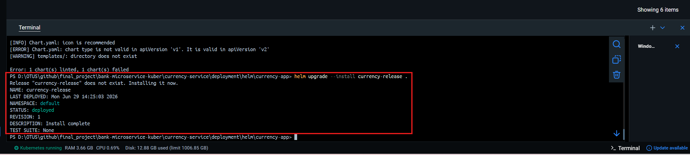
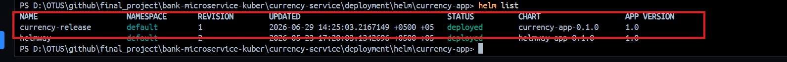

# Currency Service (Микросервис Валют и Обменных Курсов)
---
## Описание проекта
Данный микросервис является частью банковской системы (**Project Bank**) и предназначен для управления справочниками стран, международных валют, а также для отслеживания и обновления их взаимных обменных курсов в режиме реального времени.

Проект спроектирован с четким разделением ответственности (Layered Architecture):
* **Endpoint (Controller):** REST API для взаимодействия с клиентами или внешними сервисами.
* **Service:** Бизнес-логика (включая транзакционную логику Upsert для предотвращения дублирования данных).
* **Mapper (MapStruct):** Изолированное преобразование между сущностями базы данных и объектами передачи данных (DTO).
* **Repository (Spring Data JPA):** Слой доступа к базе данных PostgreSQL.

---

## Технологии и Инструменты
| Компонент       | Технология / Библиотека   | Статус    |
|-----------------|---------------------------|-----------|
| **Язык** | Java 21                   | Used      |
| **Фреймворк** | Spring Boot 3.x (Data JPA, Web) | Used   |
| **Сборка** | Maven                     | Used      |
| **Маппинг** | MapStruct                 | Used      |
| **Генерация кода**| Lombok                  | Used      |
| **База данных** | PostgreSQL                | Used      |
| **Оркестрация** | Kubernetes (Docker Desktop / Kind) | Used |
| **Менеджер пакетов** | Helm 3               | Used      |
| **Профайлинг** | VisualVM                  | Used      |
| **Тестирование**| JMeter                    | Used      |
| **IDE** | IntelliJ IDEA             | Used      |

---

## Структура пакетов проекта

```text
ru.otus.currencyservice
│
├── aggregate
│   ├── DTO         # Объекты передачи данных (CountryDto, CurrencyDto, ExchangeRateDto)
│   ├── entity      # Сущности СУБД (Country, Currency, ExchangeRate)
│   └── mapper      # Интерфейсы MapStruct (CountryMapper, ExchangeRateMapper)
│
├── endpoint        # REST-контроллеры (CountryEndpoint, ExchangeRateEndpoint)
│
├── repository      # Интерфейсы Spring Data JPA (CurrencyRepository, CountryRepository, ExchangeRateRepository)
│
└── service         # Реализация бизнес-логики (CountryService, ExchangeRateService)
    └── business    # Интерфейсы сервисного слоя
```
### HELM KUBERNET CONFIGURATION: 

#### Структура Helm-чарта
```text
deployment/helm/currency-app/
├── Chart.yaml          # Метаданные чарта (Версия приложения: 1.0)
├── values.yaml         # Конфигурационные параметры среды (Dev/Prod)
└── templates/          # Манифесты Kubernetes
├── _helpers.tpl    # Переиспользуемые именованные шаблоны
├── configmap.yaml  # Переменные окружения для Spring Boot
├── deployment.yaml # Описание подов приложения, ресурсов и проб
├── service.yaml    # Внутренний балансировщик ClusterIP
└── ingress.yaml    # Маршрутизатор внешнего трафика (currencyapp.local)
```



---

### VISUAL VM Мониторинг и Производительность

Для анализа использования ресурсов (памяти кучи, метапространства, активности потоков приложения) используется VisualVM. 
Подключение к поду Kubernetes осуществляется через JMX или посредством проброса портов (port-forward):

``` kubectl port-forward deployment/currency-release-currency-app 9010:9010 ```
### JMeter Result

Стабильность и пропускная способность (Throughput) API были протестированы с использованием тестовых планов Apache JMeter:

Сценарий: 100 параллельных пользователей выполняют запросы к GET /api/country/get/all в течение 5 минут.

Результаты: * Среднее время ответа (Average Response Time): Укажите значение, например, 45 мс

Процент ошибок (Error %): 0.00%
-----------
### Контакты
 - Автор: Urunov Hamdamboy
 - Telegram: @urunovv
 - Компания / Продукт: OTUS PRODUCT
 - Дата старта: 26.06.2026